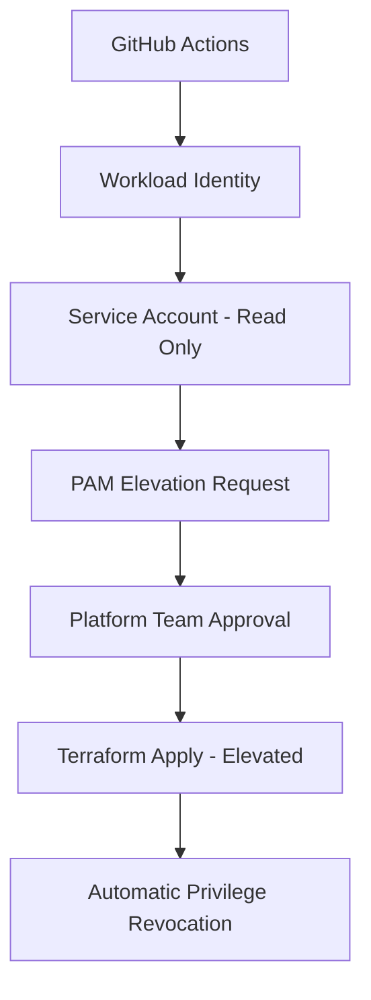

# Security Configuration - Zero Standing Privilege with PAM

## 🔒 Security Model Implementation

This repository implements a **Zero Standing Privilege** model using Google Cloud's Privileged Access Management (PAM) following the organization's security baseline.

### Architecture Overview



## 🔑 Service Account Configuration

### Terraform Service Account
- **Baseline Permissions**: Read-only access only
  - `roles/viewer`
  - `roles/iam.securityReviewer`
  - `roles/logging.viewer`
  - `roles/monitoring.viewer`

### PAM Entitlement
- **Write Operations**: Require just-in-time elevation
  - Duration: 30 minutes maximum
  - Approval: Platform team (1 approver required)
  - Scope: Limited to tenant project only

### Elevated Permissions (PAM Grant)
- `roles/clouddeploy.developer`
- `roles/container.clusterViewer`
- `roles/compute.instanceAdmin`
- `roles/iam.serviceAccountUser`
- `roles/storage.admin`
- `roles/artifactregistry.admin`

## 🔄 Workflow Security Pattern

### 1. Authentication
```yaml
- name: Authenticate to Google Cloud
  uses: google-github-actions/auth@v2
  with:
    workload_identity_provider: ${{ vars.WORKLOAD_IDENTITY_PROVIDER }}
    service_account: ${{ vars.TERRAFORM_SERVICE_ACCOUNT }}
```

### 2. PAM Elevation
```bash
GRANT_ID=$(gcloud beta pam grants create \
  --entitlement="projects/$PROJECT_ID/locations/global/entitlements/terraform-tenant-infrastructure-deploy" \
  --requested-duration="1800s" \
  --justification="Infrastructure deployment - GitHub Actions run ${{ github.run_id }}")
```

### 3. Infrastructure Changes
- Terraform plan/apply with elevated permissions
- Complete audit logging of all operations
- Real-time monitoring and alerting

### 4. Privilege Revocation
```bash
gcloud beta pam grants revoke $GRANT_ID
```

## 📋 Compliance Features

### ISO 27001 Controls
- **A.9.2.3** Management of privileged access rights
- **A.9.2.5** Review of user access rights
- **A.12.1.2** Change management

### SOC 2 Type II Requirements
- **CC6.1** Logical and physical access controls
- **CC6.2** Prior authorization of system changes
- **CC6.3** System changes are authorized and tested
- **CC8.1** Change management controls

### GDPR Compliance
- **Art. 25** Data protection by design and by default
- **Art. 32** Security of processing

## 🚨 Emergency Access

### Break-glass Procedures
For true emergencies, use the force apply option:

```bash
gh workflow run terraform-apply.yml \
  --field force_apply=true \
  --field reason="Emergency: Production outage - Incident #12345"
```

This bypasses Slack approval but maintains full audit logging and PAM elevation.

## 📊 Audit Trail

All infrastructure changes are logged with:
- **GitHub Actions**: Complete workflow execution
- **Cloud Logging**: Structured audit events
- **PAM**: Privilege elevation and revocation
- **Slack**: Human approval decisions

### Audit Log Events
- `terraform_plan`
- `terraform_apply_start` 
- `pam_grant_created`
- `terraform_apply_success`
- `pam_grant_revoked`

## ✅ Security Verification

To verify the security implementation:

1. **Check baseline permissions**:
   ```bash
   gcloud projects get-iam-policy $PROJECT_ID \
     --filter="bindings.members:serviceAccount:terraform-webapp-team@$PROJECT_ID.iam.gserviceaccount.com"
   ```

2. **Verify PAM entitlement**:
   ```bash
   gcloud beta pam entitlements list \
     --location=global \
     --project=$PROJECT_ID
   ```

3. **Monitor privilege grants**:
   ```bash
   gcloud beta pam grants list \
     --entitlement="projects/$PROJECT_ID/locations/global/entitlements/terraform-tenant-infrastructure-deploy"
   ```

## 🔧 Production Readiness

### ✅ Implemented
- Zero standing privilege model
- PAM-based just-in-time access
- Workload Identity Federation
- Comprehensive audit logging
- Slack approval workflow
- Automatic privilege revocation

### 🔄 Future Enhancements
- Integration with Security Command Center
- Advanced threat detection
- Automated compliance reporting
- Policy-as-code validation